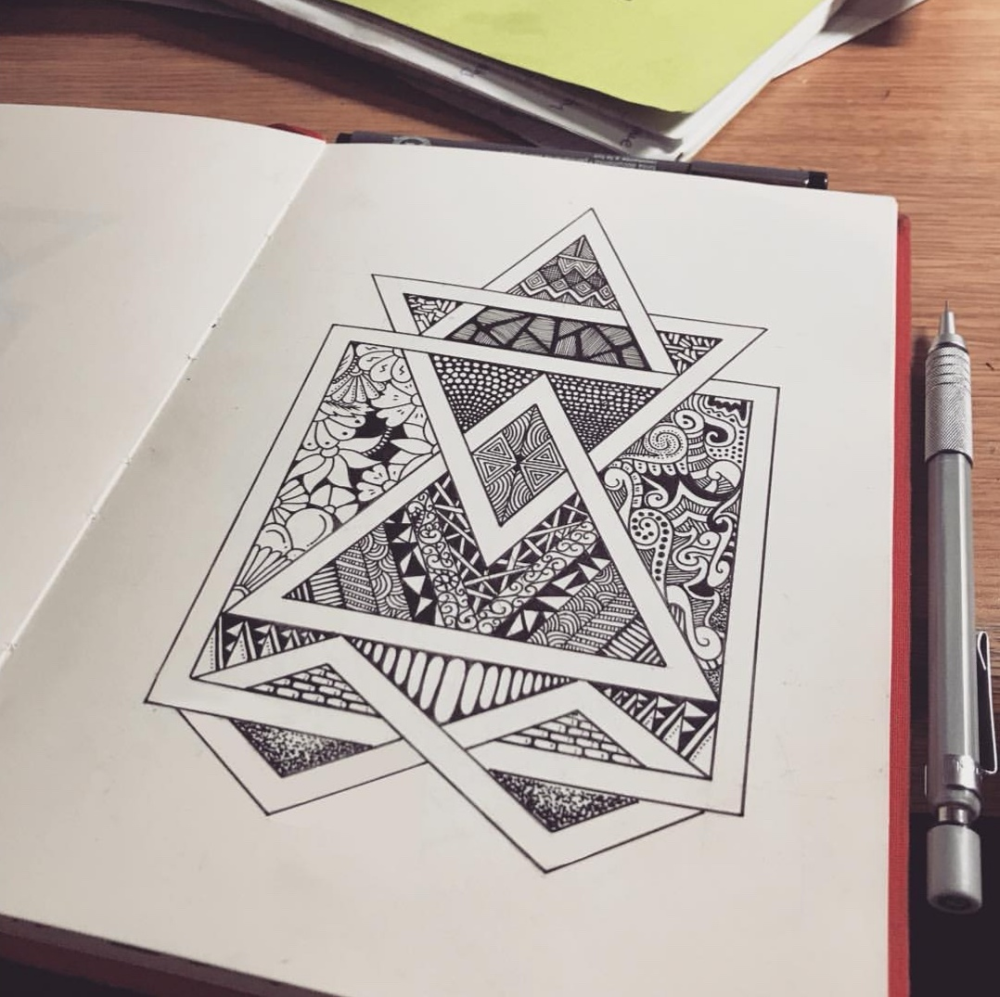
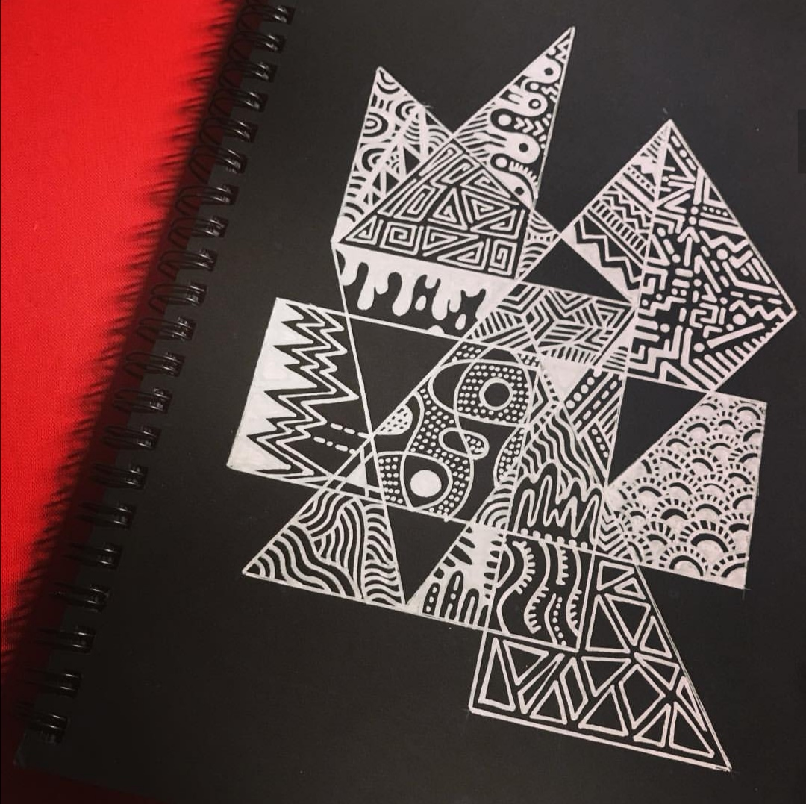
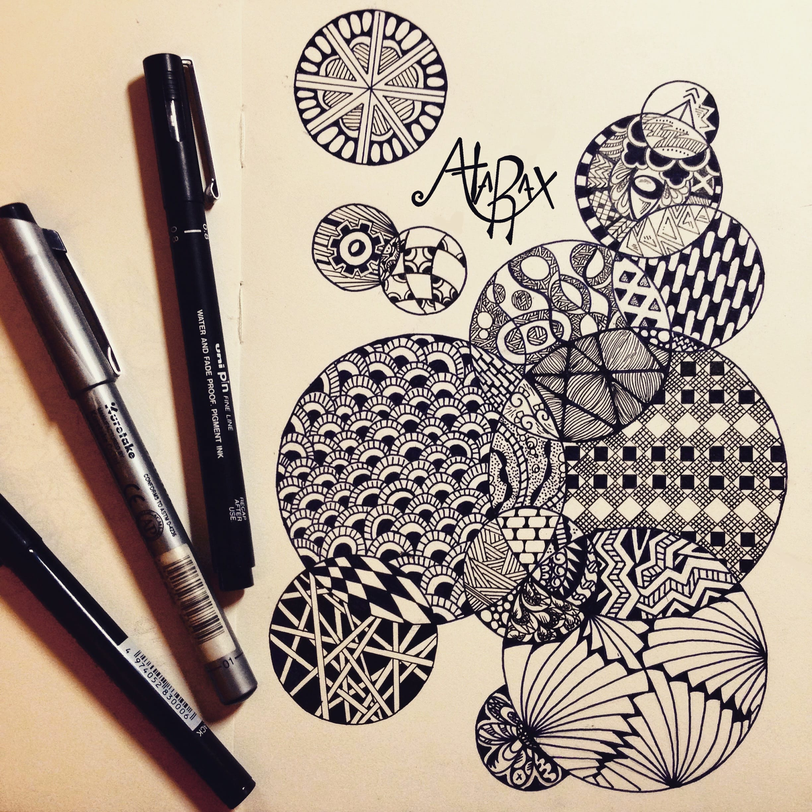

Under the moniker of _Atarax_, I started this art project on Instagram [@ataraxdesign](https://www.instagram.com/ataraxdesign/) to improve my drawing skills, inspired by the zentangle and doodle art communities on Instagram. Since starting this project five years ago, I have experimented with a large variety of techniques associated with this style, i.e. dotwork, mandala, geometric, abstract and single-line. Starting out, I used black ink pens on white paper, but since then I have amassed a collection of different pens, experimenting with white ink on black paper, watercolour ink and also incorporating digital modifications, showcased in the [Mixed Media](/green) project.

