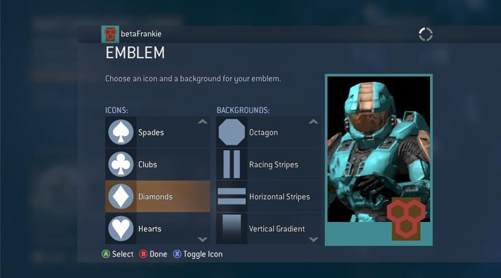
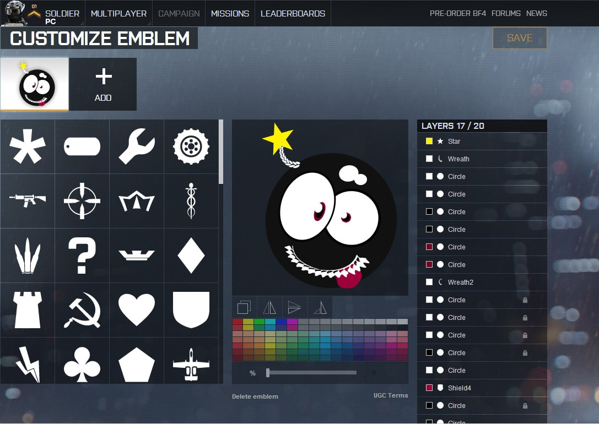

## MY ROLE

_Disclaimer: Details have been omitted to comply with my non-disclosure agreement._

This was a project I worked on as a **UX/UI Designer** at a games studio that was maintaining a live free to play mobile title. I was given a brief for an emblem builder that would allow players to create a custom emblem for their team. I was responsible for designing the structure of the emblem creation experience as well as prototyping the interface. I researched existing solutions, designed screens and put together an interactive prototype in Adobe XD and Marvel (shown below). I created high fidelity mock ups of the builder in the visual style of the game. (Unfortunately, I can not share these visuals). I also investigated implementation strategies in the Unity game engine using NGUI.

<h4 align="center">CONTENTS</h4>

    <a href="#problem" style="white-space: nowrap">The Problem</a> 
    <a href="#research" style="white-space: nowrap">The Research</a> 
    <a href="#structure" style="white-space: nowrap">Designing The Structure</a> 
    <a href="#prototypes" style="white-space: nowrap">The Prototypes</a> 

## THE PROBLEM

In the existing system, players were able to choose an emblem from a finite set of pre-designed choices in a variety of colours. This restriction of choice conflicted with the long term goal of **improving player engagement by providing opportunities for individual expression** (a theme also explored in my work with [Emojis](hjkhhk)). The idea of an emblem builder was not new to console/PC games. However, on a mobile interface, the **restrictions on screen space translated into a lack of customisability** due to difficulties integrating complex controls.

## THE RESEARCH

In my preliminary research, I investigated existing emblem builder solutions in console/PC games. In particular, I wanted to understand how they broke down the emblem building process into smaller steps. Generally, I found there were two types of approaches.

#### FOREGROUND/BACKGROUND APPROACH

The builder provides shape options for use in the foreground or background. Foreground shapes are more complex and detailed while background shapes are bolder solid shapes. The approach is resonant of the ‘engraved crest’ where a crest shape and engraved pattern was chosen. The two shapes could then be coloured individually.

The emblem builder in Halo and Guild Wars is a good example of this.

Halo Emblem Generator

Players choose a foreground and background shape then colour each one separately from a different screen.

Guild Wars Emblem Generator

Supports two colours on foreground shapes allowing players to choose a primary and secondary colour, bringing greater colour variety.

#### LAYERED SHAPES APPROACH

The builder allows players to layer individually coloured shapes on top of each other. Some would also allow shapes to be individually resized and positioned rather than automatically centred. This approach is reminiscent of photoshop and lent itself to increased creativity as even with simple shapes, players could create an infinite number of designs.

The emblem builder in Battlefield 4 used this approach.

Battlefield 4 Emblem Generator

Allows users to layer shapes on top of each other and colour them individually. The shapes have a varying levels of complexity but can be composed together to make a huge variety of designs.

## DESIGNING THE STRUCTURE

Before starting to prototype the interface, I had to pitch the emblem creation process that I wanted to implement. My proposal broadly followed the ‘Layered Shapes Approach’, but I made a few key modifications and additions to suit our game and the mobile interface.

<ol>
  <li>Touch gestures for scaling and positioning shapes. </li>
  <li>Shapes would be offered in bundles that could be unlocked or purchased (to provide long-term monetisation and extension potential).</li>
  <li>Colour control would be offered through a fixed set of 12 swatches and users would adjust lightness darkness to create variety.</li>
  <li>Text could be used on emblems, but text content could not be customised (to avoid inappropriate content). Players could only display their team name, but could choose from a variety of render styles which could be also be offered in bundles.</li>
</ol>

## THE SOLUTION

<iframe src="https://marvelapp.com/a26j1ie?emb=1&iosapp=false&frameless=false" width="948" height="676" allowTransparency="true" frameborder="0"></iframe>

Interactive prototype of final emblem builder design

One of the key frictions in previous iterations was the display of the layers. I couldn’t decide whether the top most layer should be shown on the right or left, and similarly which side the “Add New Layer” should be on. Interviewing several of my team for input led to a huge variety of views on what set up would ‘make sense’. **I realised that if what was right wasn’t clear, perhaps of whole approach was fundamentally counter-intuitive.**

This version was designed with a **vertical layer stack** in mind. This way there would be no dispute as to which was the top layer. It is also the version which I feel truly shed the influence of the console/PC versions I had initially used as inspiration. I also **maximised the canvas area** in line with the decision in Version 3 to **fully commit to touch gestures** as the main method of interacting with shapes. This was instead of the ‘full screen mode’ I had previously incorporated to give users a screen with a larger canvas.

The reduced area available for the menu due to the larger canvas increased my reliance on **context based menus**. With just a one column menu to work with, I had to break down my workflow into even smaller steps. The main challenge with this was how to go backwards. In an ideal situation, users would progress linearly forwards, but in the use case where users needed to return to a previous menu, I decided to have the ‘back’ button go back one step at a time. While this could be tedious for big changes, for the general use case it was largely sufficient in a context based menu system. Instead of having a dedicated back button, the title of the current menu served to return users to the previous menu. This was in line with an existing convention in the game and saved screen space.

_Note: The back behaviour was hard to incorporate into a manual prototype due to the need build an excessive number of screens to accommodate all the changes to the canvas. To see it in action I would recommend trying it in the first few screens of the prototype above._

## THE PROTOTYPES

My design for the interface went through three iterations before reaching a layout and workflow that was I was happy with. The main challenge was making the design simple enough to be used on a small mobile screen while still providing access to a certain level of control. Each iteration was evaluated by other members of the UX/UI team and I continued to iterate until I stopped getting “make it simpler” as feedback.

#### VERSION 1

Also known as the ‘Power User Version’, my first version encompassed all the functionality I could possibly want in the emblem builder in a single screen. The use of the accordion collapsing menu style, drop down menus and toggled menus were my attempt build for a small screen size while maximising element size and still providing a variety of options.

Importantly, since I wanted to use touch gestures to manipulate shape size and position I endeavoured to make the canvas size as large as possible on the screen. This limited the remaining space available for the menu.

The menu represented the three stage process I envisioned for the emblem building process.

<ol>
  <li>Choose a background shape and texture</li>
  <li>Add additional layers of shapes and choose their colour</li>
  <li>Choose a render style for displaying your team name</li>
</ol>

Drop down menus were used to facilitate the bundle system where shapes came in bundles which could be unlocked or purchased. The toggle menu was used to switch between the Colour/Texture menu and the Transform menu which provided an alternative to touch control for the scale and position of shapes.

The use of a slider in the colour and transform menus were used to provide a more touch based interface instead of requiring text input. For colour the slider adjusted the lightness/darkness of the chosen colour swatch. For transform, the slider would adjust numerical values depending on the chosen transform i.e. for Horizontal transform, the slider would move the shape from left to right.

  

Animated slideshow of the screens designed for Version 1. Exported from Adobe XD.

#### VERSION 2

In this version, I focused on making the menu interface as simple as possible given the same amount of screen space. I removed the distinction between Background and Shapes, reducing the types of layers that could be added to just Shapes and Text.

Moving away from the accordion menu style to a more context based menu, users are asked to specify which type of object they’d like to add before being shown the relevant menu. I made use of the previously unused screen space on the left side by moving the transform menu underneath the canvas. The new system provided a more **guided workflow** where users were presented with a limited amount of choice at each stage and once choosing a direction, changing it was more complex than in Version 1.

For example, in this version users the menu options refer only to one layer at a time, and the layer is chosen at the beginning of the workflow. The menus then displayed refer only to the shape on that layer. To change layer the user must navigate back to the start menu. I essentially designed a **core loop of interaction** to be repeated until the user completes their design.

  

Animated slideshow of the screens designed for Version 2. Exported from Adobe XD.

#### VERSION 3

While Version 2 represented a significant simplification of Version 1, the general feedback was that it still felt clunky and crowded. It was fine for a tablet sized device, but for mobile sized devices would still be too fiddly. To simplify the interface further I stripped back the functionality I wanted to provide.

<ol>
  <li>I removed the transform menu and thus the ability to control scale and position via on screen controls. Users would just have to use touch gestures. I also removed the preview of the selected shape in the menu.</li>
  <li>I removed the shape preview from the menu. Previously after selecting a shape, a larger preview would be shown in the menu and colour applied to this preview before being added to the canvas. However, I realised this was extraneous as the shape could just be immediately previewed on the canvas.</li>
</ol>

A key change in Version 3 was the redesign of the layer display system. Previously, the different layers could only be viewed from the initial menu and not in the later context based menus. However, the layers themselves were not directly related to the provided contexts i.e. whether the user was adding a shape or text. Therefore, I endeavoured to **make it possible to view all the layers in the emblem at all times**. By putting the layers on screen at all times, it allowed users to easily switch between which shape/text layer they were modifying and make quick changes to a shapes they had added before.

  

Animated slideshow of the screens designed for Version 3. Exported from Adobe XD.

