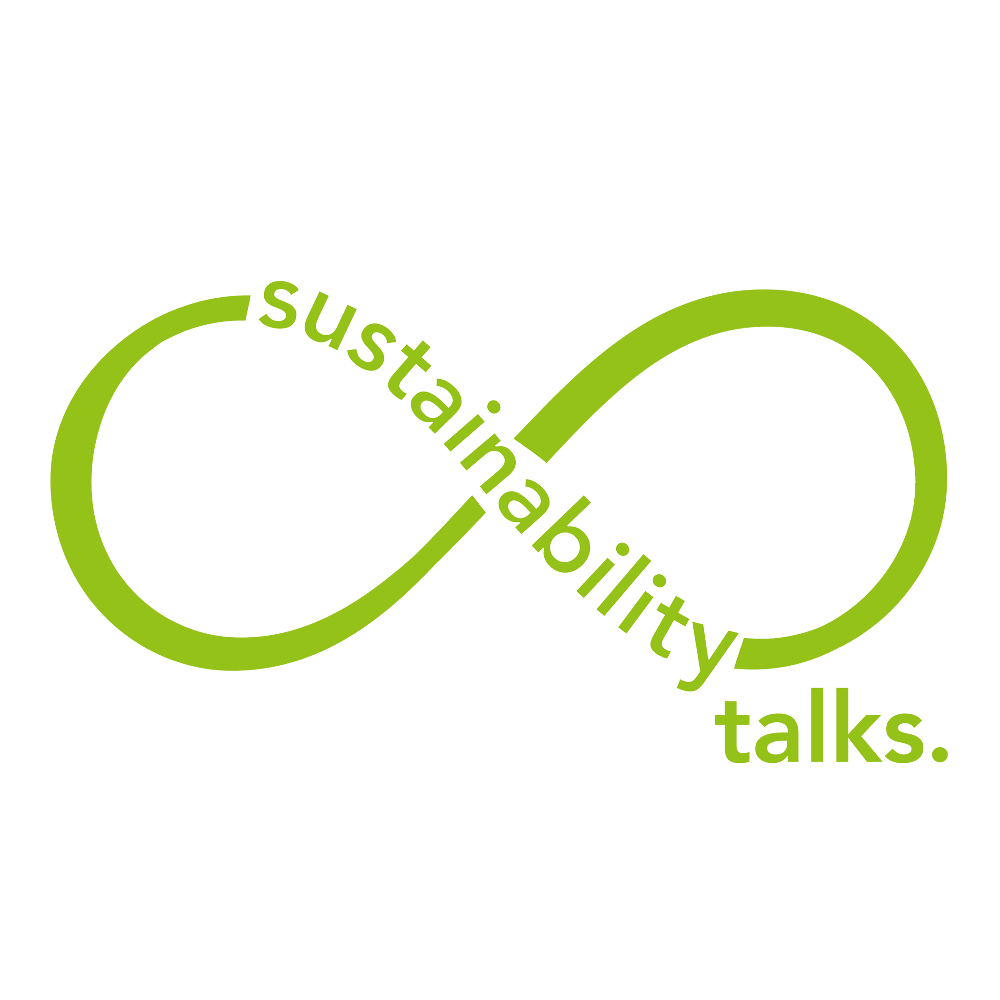
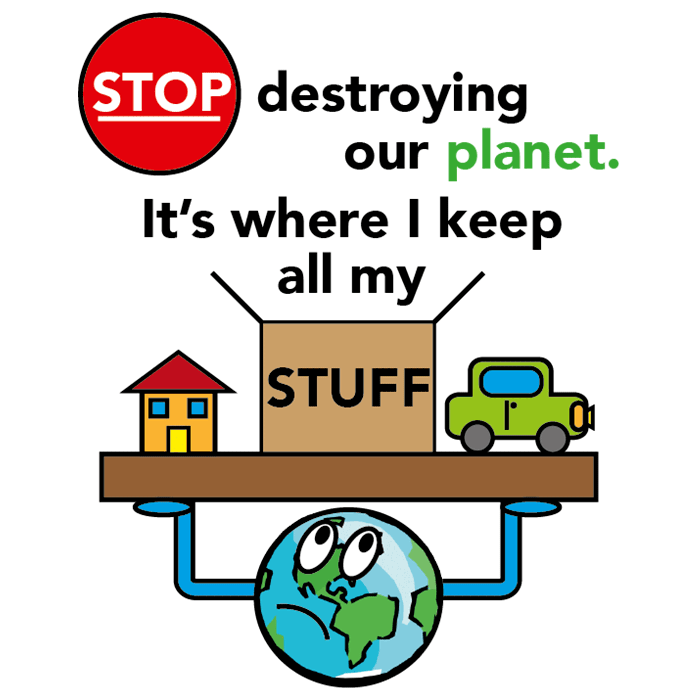

[eReuse](http://www.ereuseproject.org/) is a student-run social enterprise that began as part of the [Enactus](https://enactus.org/) program at the University of New South Wales. As it grew in size and success, its leadership decided to break away from its Enactus parents and cultivate broader partnerships. **I was brought on as the visual and graphic designer for the rebranding campaign.** I was responsible for designing the new logo, and determining the visual language of our other marketing assets accordingly. This focused on a push for social media content and stickers to be distributed around campus in the lead up to a large sustainability conference we helped organise.

Conference Logo

Promtional Sticker

