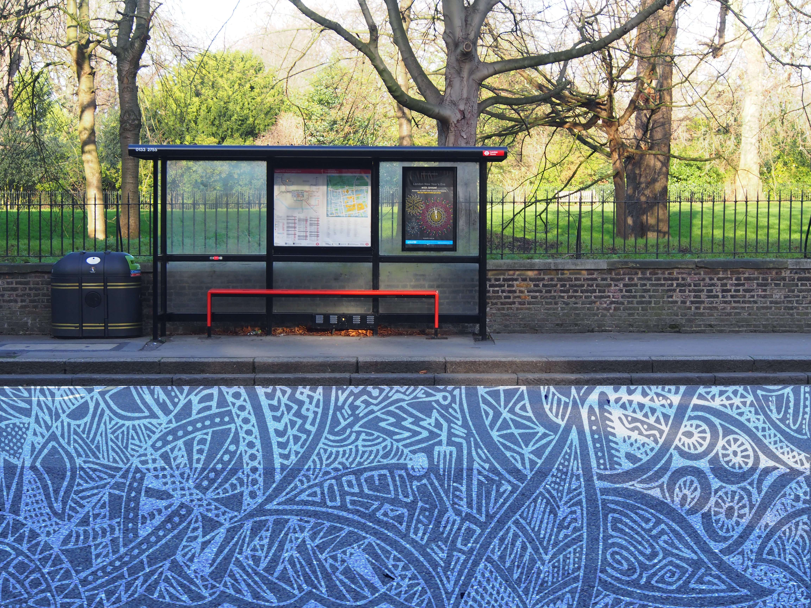

This project is one I took on to improve my Adobe Photoshop skills, while making use of my passion for photography. By experimenting with the overlay effect, this project mixes art and reality to see how shapes and patterns fit into scenes of our daily life. Most of the photographs were taken at locations near my university and my house, places I encounter on a daily basis.

I photographed with a focus on capturing geometric shapes and block colours that would compliment my drawing style when overlaid. The artwork is hand-drawn with black ink pens then post-processed digitally before being incorporated into the photographs.

