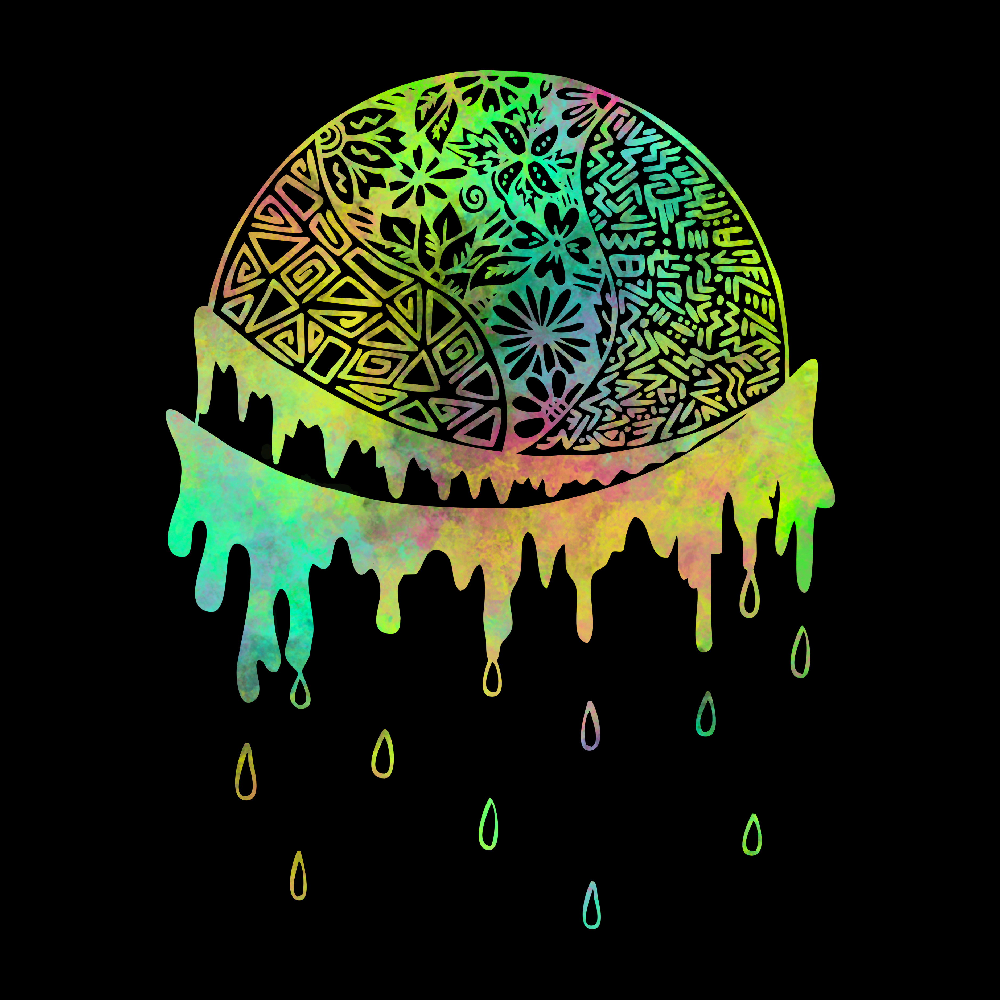
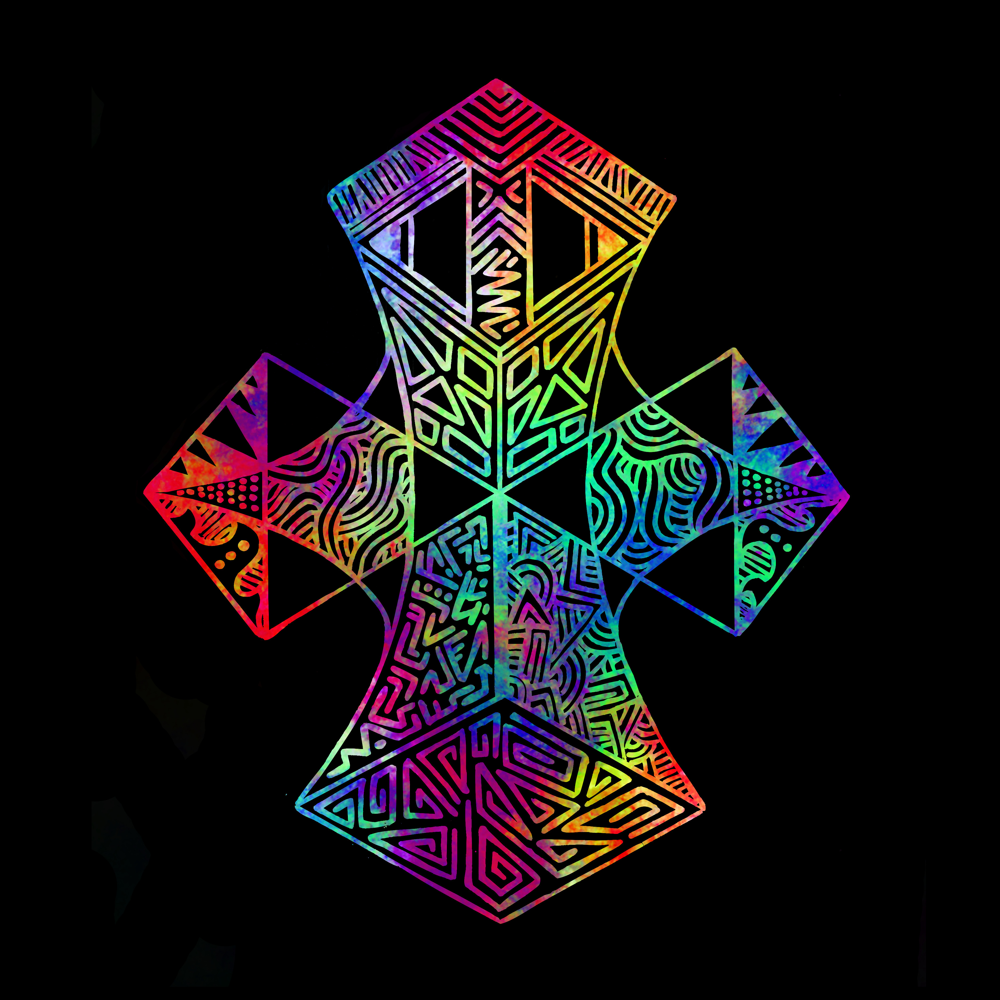
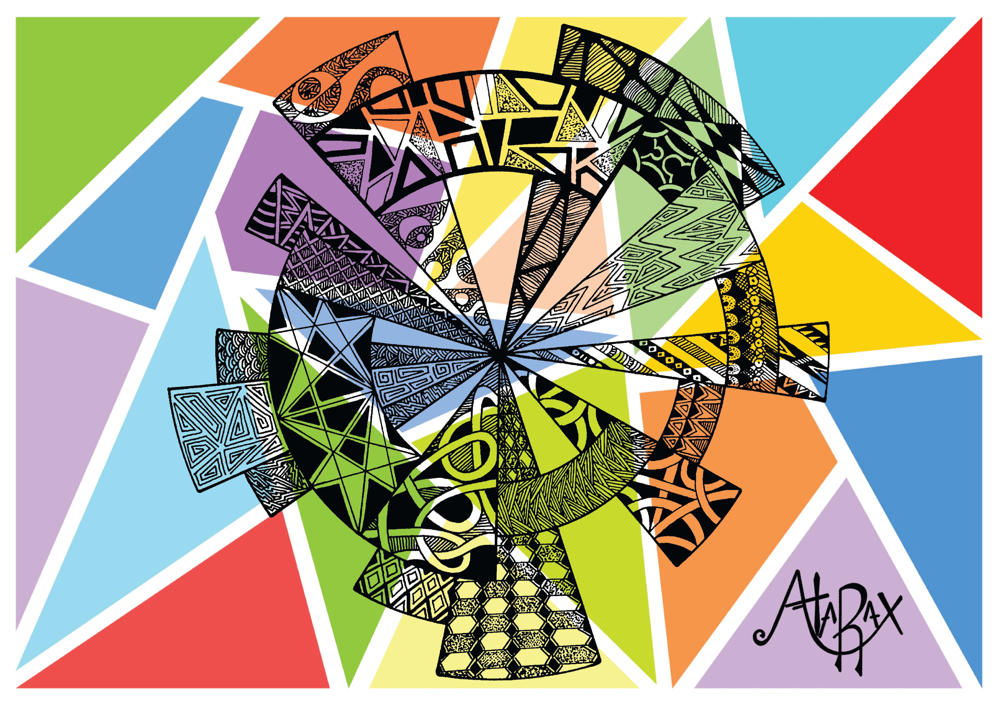

After working in black and white for the majority of my drawings in the Atarax Project I decided to combine my desire to incorporate colour with learning new Photoshop skills. The main challenge was the detailed fine lines in my hand-drawn line drawings. Trying to extract clean line art after scanning them proved rather inefficient. I eventually developed a very specific pipeline and wrote a tool to ensure the designs came out in the best format for digital manipulation. I have provided some examples of plain extracted line art and coloured versions.

