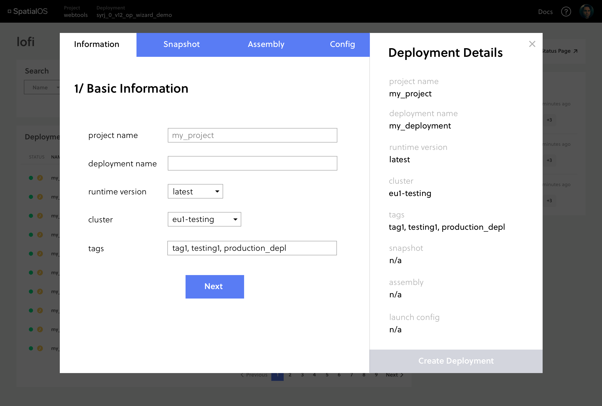
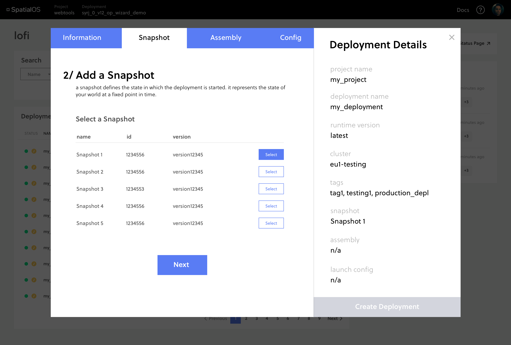
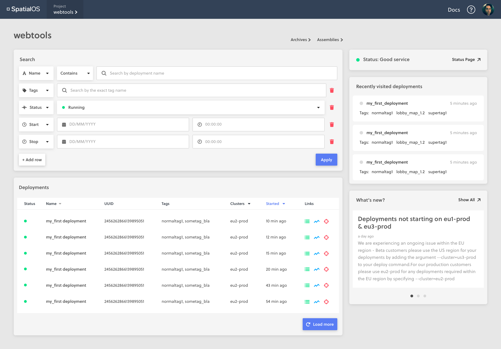
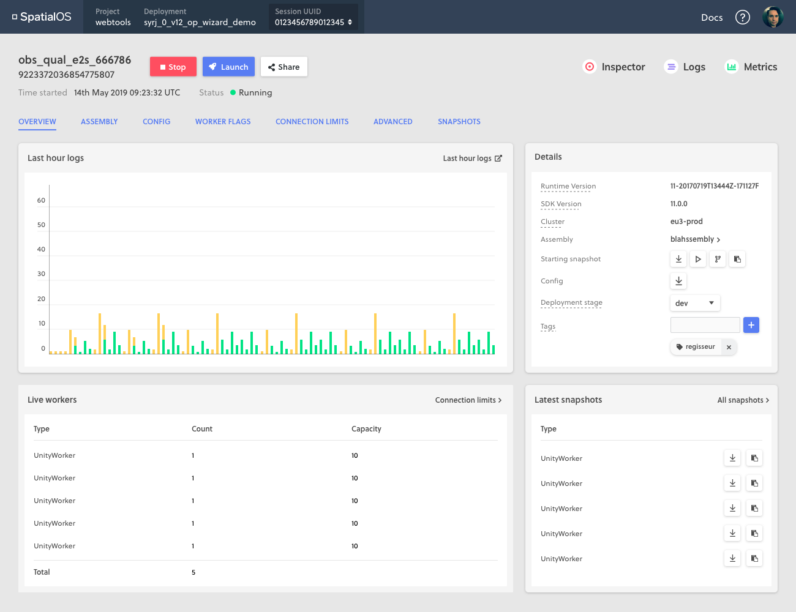
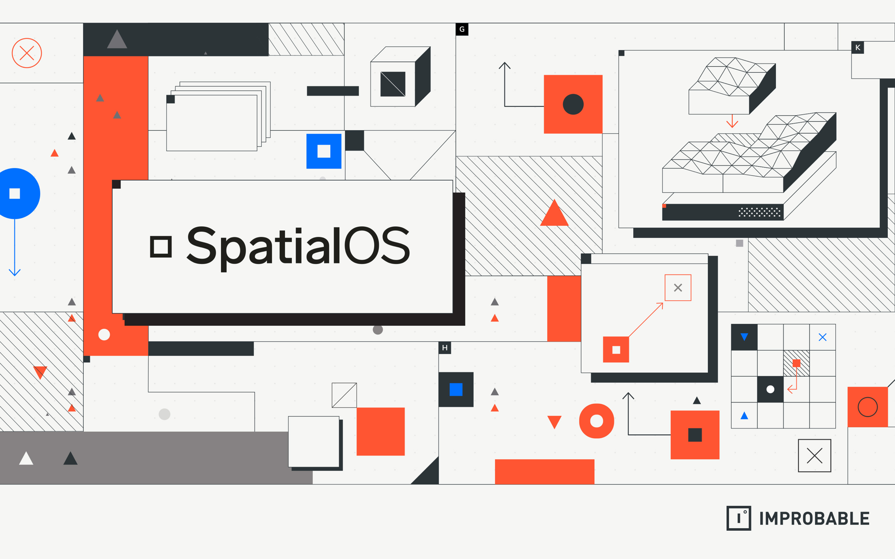
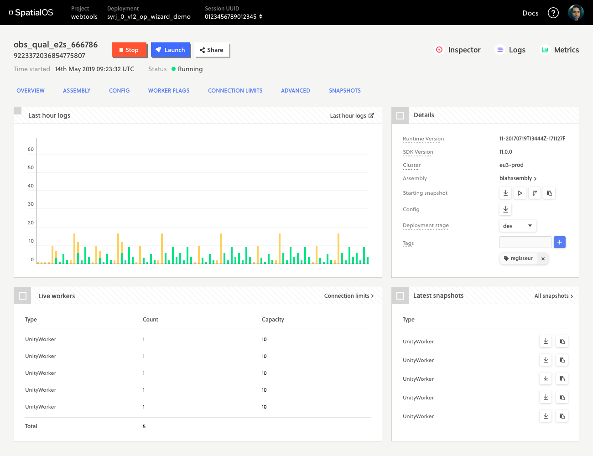
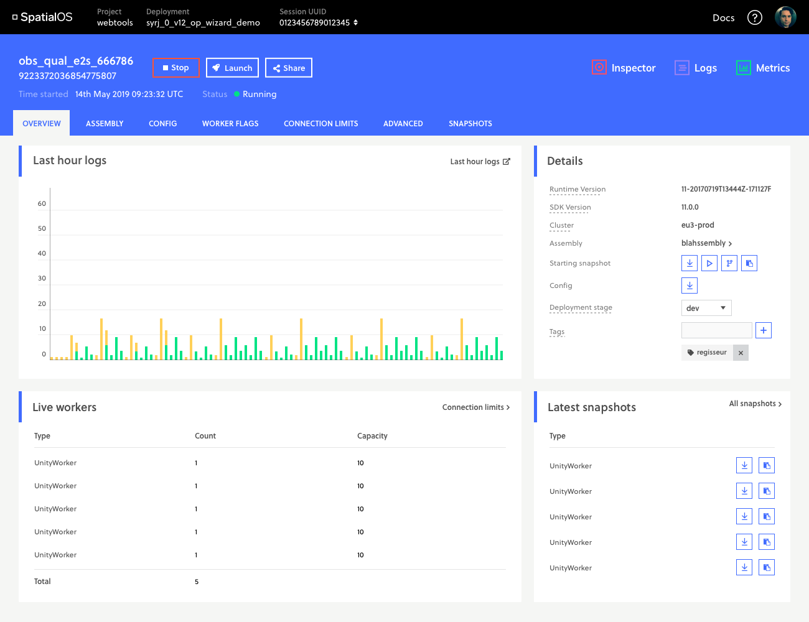
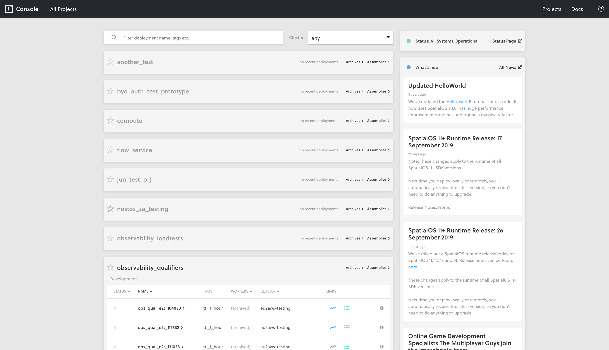
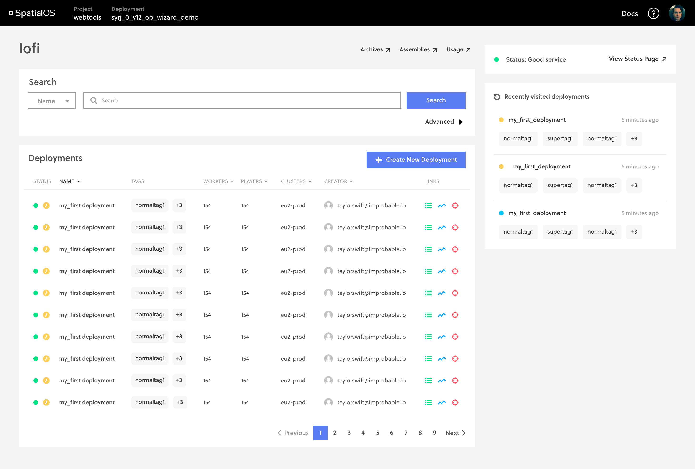

## MY ROLE

I currently work as a **User Experience Engineer** on the Web UIs team at Improbable. As part of my role, I develop single page applications used to develop with Improbable software SpatialOS. The main technology stack is React, Typescript, Redux, Webpack.

Other responsibilities include:

<ul>
    <li> Research, design and build new features </li>
    <li>Conduct usability tests on new designs and action feedback in follow up releases.</li>
    <li>Build and maintain internal library of reusable components and design frameworks for rapid prototyping</li>
    <li>Liaise with API teams to expose new API functionality in the UI.</li>
    <li>Collaborate with other teams to provide front end skill expertise to other engineering teams </li>
    <li>Mentor non-engineering staff in front end technology skill development </li>
</ul>

## PROJECTS

As these projects are ongoing, I am limited in the details and visuals of these projects that I can provide, but I have provided a basic overview.

<h4 align="center">CONTENTS</h4>

    <a href="#create" style="white-space: nowrap">Designing the Create Deployment Flow</a> 
    <a href="#search" style="white-space: nowrap">Scalable Search</a> 
    <a href="#brand" style="white-space: nowrap">Redesigning for Brand Alignment</a> 
    <a href="#scale" style="white-space: nowrap">Redesigning a Web App for Scale</a> 

#### DESIGNING THE CREATE DEPLOYMENT FLOW

I was asked to propose a UI flow for creating a new deployment, a process currently only possible using a command line tool. This required investigation into this CLI process and what information a user was expected to provide when creating a deployment.

With a list of required user inputs, I began to design a UI wizard to guide users through the process. For certain stages, user inputs were more complex than just text and dropdowns. For example, users needed to be able to select from a list of available snapshots and assemblies or upload their own zip files. The launch configuration was a JSON file that also needed to be uploaded, but users expressed strong interest in being able to modify and generate the file through the UI.

As a result, a secondary task of building a JSON file generator UI was cut from the main task. This UI would be integrated into the Config step of the Create a Deployment wizard.

As users fill in basic deployment information, the overview on the right updates. The navigation bar on top shows them the steps they have to take to create a deployment and what stage they are at.

The snapshot step, like assemblies and config requires more complex user inputs

#### SCALABLE SEARCH

Following the redesign of the Console to support large numbers of deployments (10,000+), a need for the ability to search and filter these deployments quickly became evident.

I worked with the API team to design compatible server side filtering functionality. I researched and designed the UI for basic and advanced search. I also implemented the feature and managed the internal and external release to users.

Some of the main design challenges I faced were centred around different user groups having very different use cases for the feature. For example, some users wanted the search to default to certain filters, while others wanted to be able to save their filters and reapply them later. Balancing all these requirements to build one product required flexibility and compromise.

Mock up for advanced search functionality

#### REDESIGNING FOR BRAND ALIGNMENT

New brand guidelines were supplied by the marketing team and the team was tasked with updating our web applications to better suit the new style. The challenge was that the guidelines were designed for print and media use rather than UI. The 'boxy' style when used for UI threatened to look too old-school, dated rather than modern. Below are a few of the investigations I came up with.

Current design

Example of the new brand's visual look used for inspiration

Redesign Option 1

Redesign Option 2

#### REDESIGNING A WEB APP FOR SCALE

The aim of this project was to improve load times for the Console, a web app used by SpatialOS developers to manage their cloud deployments.

The current web app had poor loading times for users with large numbers of deployments because the API used did not page data, instead waiting to receive one large segment of data before loading the page.

New APIs had been built, and our team was tasked with reimplementing the web app to hit these APIs, focusing on ensuring that it would still work well when users had 10,000 deployments.

A structural redesign of the sitemap was also needed to reflect changes in how the API stored deployment data. We wanted users to focus on viewing different runs of the same deployment, rather than different deployments in their project. This was due to the realisation that external customers often only had one project, so the multi-project focused view was only useful internally. This change in the information hierarchy we wanted to present was central to our work in redesigning for the Console to work at scale.

Original landing page, showing a user all their projects, then drilling down into the deployments in that project, runs were not visible.

Current design of the new page, with support for 10,000 deployments

Prospective stylistic redesign based on new brand guidelines

