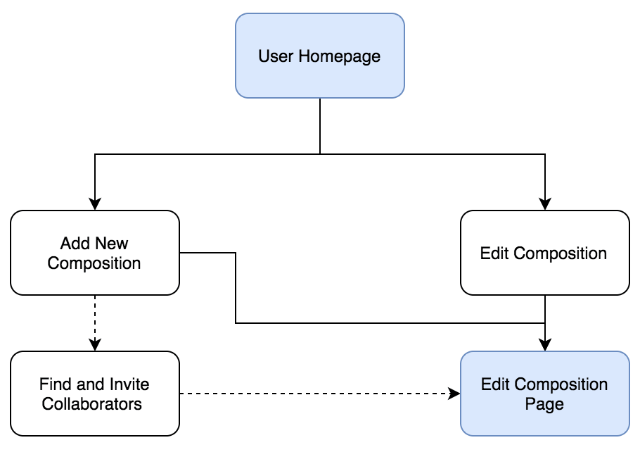
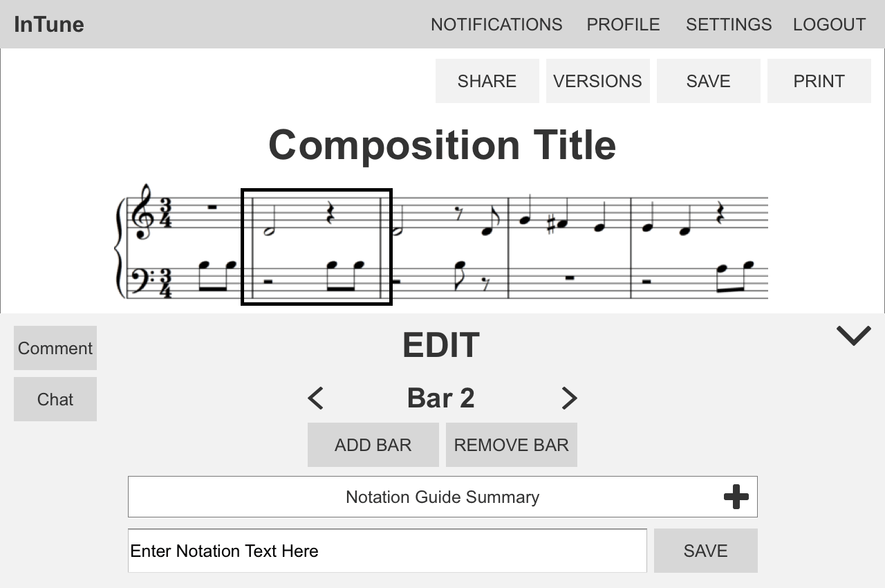
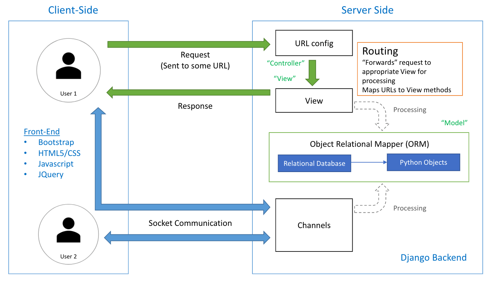
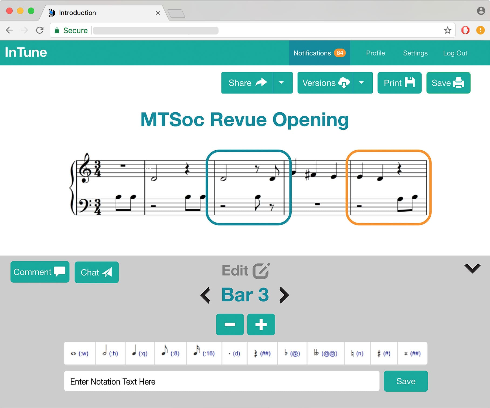
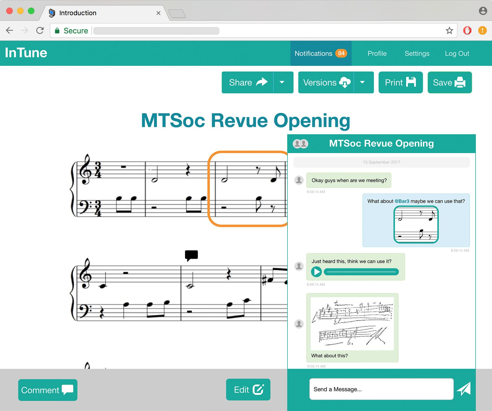
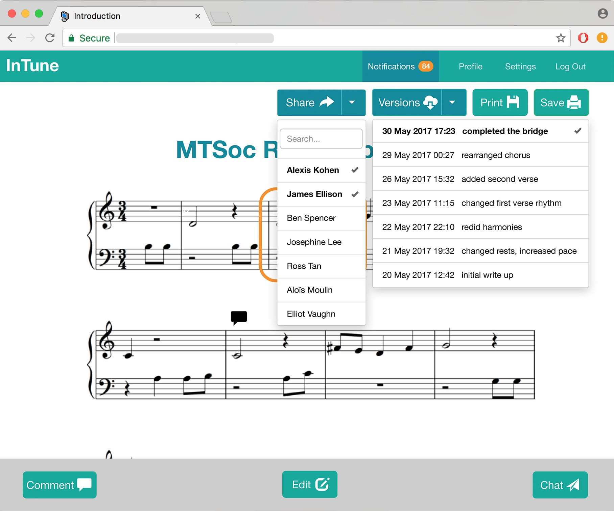

## MY ROLE

I was part of a team of 4 developers who worked on this web application. As a code heavy project, I took on the role of **designer** both for my team’s benefit and for personal development. In this capacity I worked on interface and user workflow design.

As a **programmer**, I focused on front end development and integration. My main back end contribution was implementing multi-user functionality outside of concurrent editing. For this, I implemented notifications, comments and chat systems.

<h4 align="center">CONTENTS</h4>

    <a href="#problem" style="white-space: nowrap">The Problem</a> 
    <a href="#solution" style="white-space: nowrap">Our Solution</a> 
    <a href="#flow" style="white-space: nowrap">Designing User Flow</a> 
    <a href="#design" style="white-space: nowrap">Key Design Decisions</a> 
    <a href="#prototype" style="white-space: nowrap">The Prototype Feedback</a> 
    <a href="#future" style="white-space: nowrap">The Future</a> 

## THE PROBLEM

#### POOR FILE MANAGEMENT

Existing music notation software lacks version control, and over the course of a collaboration, many copies of the same file build up. It is not uncommon to a project folder with file names like “Composition – V1”, “Composition – V2” and so on. It quickly becomes difficult to know whether they are working on the most up to date version. In addition, merging changes between composers who initially started on the same file is also convoluted.

#### FRAGMENTED COMMUNICATION

Musicians often email each other different versions of the ‘current’ music notation file to keep each other up to date. With large file sizes and proprietary file types, this process is fraught with unnecessary complexities. In addition to email, collaborating musicians often communicate through some kind of team management software like Slack, or simple through a social messenger like WhatsApp, Skype or Facebook. It is not uncommon to see a mixture of images, audio recordings and videos being sent to discuss the music notation. It can become hard to keep track of these messages, especially for longer collaborations.

## OUR SOLUTION

#### CONCURRENT EDITING

To tackle the problem of poor version control and a complicated workflow for remote collaboration, we envisioned a concurrent editing system for music notation. Our goal was **Google Docs, but for sheet music.** It would be possible for multiple composers to work collaboratively on a single shared copy of the composition. When editing concurrently, they would see each others changes live.

In addition, a simpler **version control** system similar to that which we (as programmers) were familiar with, would allow composers to browse through a linear history of saved versions. In conjunction, these features would eliminate the need for composers to send each other updated copies of music notation files.

#### BUILT IN COMMUNICATION CHANNELS

To tackle the problem of fragmented communication and ensure that our web application provided the most all-encompassing composition experience, we designed built in communication systems that complemented the composition workflow.

**1. Comment on each bar of the composition**

- To allow for detailed discussion about specific areas of the composition, each bar has a separate comments section to allow for annotations, suggestions and discussion.
- This allows composers to keep track of the changes they made to this bar and the conversations they had that led to them.

**2. Separate chats for each composition**

- For more general discussions i.e. about the tone of the piece, time signatures or arranging meetings, each composition has a chat that allows all composers involved to communicate.

With these features, composers should have no need to leave the app during the composition process. In addition, all records and notes about their compositions would be conveniently stored in one place.

## DESIGNING USER FLOW

When designing the user journey through the application, it was important I had a strong vision about where our application belonged in the world of music notation software. **Our focus was collaboration.** We were not looking to compete with existing music notation software available on the market which provided incredibly powerful and comprehensive notation scribing capabilities.

Instead, we wanted to provide a platform for collaboration, where notation capabilities were functional but not central to the whole experience. With this in mind, I set out to design workflows and screens that emphasised the applications collaborative capabilities.

#### THE CORE LOOP

In line with our focus on collaboration, we wanted our platform to be a community of composers. Having user profiles allowed us to achieve this and was the intuitive strategy for giving the app a long term presence in a composers workflow. It should be their go to application to view all their composition work or start a new composition.

A straightforward ‘goal-based’ homepage makes it easy for composers to get started on their projects.

#### THE CENTRAL EXPERIENCE

The majority of the application’s core functionality was built around the central function of editing a composition. It presented a challenge as in terms of screen design as it was important that each feature got adequate but suitable screen real estate and featuring. Similarly, designing how they all interacted with each other to create a intuitive composition workflow required significant trial and error. This is discussed further in Key Design Decisions.

An outline of the possible actions that can be taken from an Edit Composition Page. The majority of features that we designed, like version control and chat start from a composition.

## KEY DESIGN DECISIONS

#### TEXT INPUT VS MOUSE INPUT FOR NOTATION

Our investigation into which method of notation input our application should use started as a discussion about preference. However, it soon grew to a larger debate about usability, flexibility, our target audience and the reasons for which we intended our app to be used.

Existing music notation software is largely text-based, incredibly thorough and very powerful. For the purpose of scribing music notation, there is little that the key players are lacking, especially as they have been leaders in the field for years. While it was tempting for us to try and introduce a ‘beginner friendly’ mouse or drag and drop input method, **I soon realised that to develop a system with equivalent levels of customisability and thoroughness, mouse input didn’t really have a learning curve that was any less steep.** Notation that took two keystrokes to achieve would translate into 10 mouse clicks through numerous menus with a huge number of options. This was not only less efficient but despite having an ostensibly simpler interface would represent a completely new interface for users familiar with existing music notation standards. Thus, a large section of our target audience would have to learn a new notation system just to use our application.

This led us to really narrow down who our target audience was. In particular, whether they would have music notation experience and whether text-input would represent a significant barrier to entry for them. The goal of our app was to help musicians compose sheet music together, not help aspiring musicians learn sheet music, or remove the need to understand notation altogether like some sound-input applications. With this in mind, we came to the conclusion that our target audience would not be hindered by a text-input system, and those who were would not be converted by a mouse input system as the **main barrier to entry was knowledge of music notation itself.**

Finally, our project roadmap beyond this initial prototype included developing a mobile version. Given the focus on collaboration and the ability to compose in groups remotely, the intuitive next step was the ability to compose ‘anywhere’ using a mobile device. With this in mind, text-input was the clear choice compared to trying to use a fiddly touch input system on a mobile phone. It didn’t make sense to develop a whole new input system for mobile, especially if it involved a significant learning curve (as discussed before). Thus, **text-input was the most scalable solution.**

In the future, it may become viable to introduce a mouse input option to widen our user base, and help more musicians access to notation software, but **for our initial build we decided on text-input.**

Users edit the composition on a bar by bar basis to keep the text notation manageable. The summarised notation guide provides the keyboard shortcuts for common notation for easy reference. It can be expanded into the full notation guide. The Edit window can be hidden/show as needed to maximise viewing of the composition itself.

#### THE EDITING WORKFLOW

Throughout the whole design process, I remained very aware of existing notation solutions and strove to remain distinct and true to our initial visions in my design. **It was important that we didn’t become “just another online notation product”, but distinguished ourselves as a collaborative platform.**

I wanted the collaborative flow our app to complement the editing workflow so that users could switch between communicating with team members and editing notation smoothly and intuitively. **To achieve this, I devised different communication channels and aligned them with different parts of the editing workflow.** Comments would be aligned with the Bar by Bar editing structure, so users could comment on each bar individually. This would provide a structure for organising annotations on the music as well as facilitate detailed discussion about the music. The chat would be aligned with each composition, providing a medium to discuss the piece more holistically as well as general team administration. Finally, notifications would tie these channels together by providing user with a summary of all activity in all their compositions.

<ol>
  <li>Users are notified when any composition they are involved in is, edited, commented on or receives new chat messages. </li>
  <li>Users can share their composition with others to start a collaborative composition </li>
  <li>Unread comments on a bar are highlighted on the composition </li>
  <li>Users can chat on a per composition basis, to keep their conversations organised.</li>
</ol>

Upon selecting a bar, users can view existing comments or add a comment. The Edit and Comments pop up can be quickly hidden when not needed to maximise the viewing area of the composition.

In addition, as part of the concurrent editing functionality, users can see if another user has selected a bar. It is not possible to edit a bar currently selected by another user. This is a restriction designed to prevent clashing changes. 

Each composition has its own chat, allowing users to keep their discussions organised. To help incorporate existing chat behaviour we observed from collaborating composers, we added a few key features to our chat:

<ol>
  <li>Reference bars from within the chat. @Bar21 will bring up that bar in the chat window </li>
  <li>Input notation text into the chat. Users can compose a bar send it as a message. The bar can then be quickly added to the main composition.</li>
  <li>Send photos and audio snippets </li>
</ol>

#### TECHNICAL OVERVIEW

For this project, we made the decision to use the Django framework to develop this prototype because it had strong front end to back end integration and its grounding in the model view controller implementation theory was familiar to us. In addition, with a very limited time frame to deliver a working proof of concept, we wanted to reduce our learning curve by developing in Python, a language we were already familiar with.

Alternatives we strongly considered were Node.js and Ruby on Rails. We had no experience with Ruby and Node.js was not as thorough as Django in providing structured back end interaction. In particular, we anticipated the front end of displaying and editing music notation to be the main challenge of our project and wanted to minimise complications in the back end and database management, for which **Django’s built in Object Relational Mapping was ideal.**

For the front-end, we used the **Bootstrap library** to streamline HTML and CSS development. As seen in the screenshots of our initial product, we prioritised functionality and honouring basic layout design over visual aesthetics through extensive CSS customisation.

<b>System Architecture Diagram</b> 
A break down of our code base structure.  Our system design was heavily influenced by the Model-View-Controller architectural style. A key element was the use of Django Channels to build collaborative functionalities i.e. comments, chat, notification and live changes while editing.

#### RENDERING MUSIC NOTATION

After some research, we chose to use the [VexFlow API](http://www.vexflow.com/) and its [VexTab](http://www.vexflow.com/vextab/) language as the basis for our notation rendering capabilities. We built an intermediate language between its text input structure and the one we wanted our app to use. We then developed a system to serialise its data so it could easily stored and retrieved from our database. Once this was working, we focused on integrating Django Channels so that changes to the composition would be displayed live to facilitate better concurrent editing.

#### HANDLING WEBSOCKETS

When researching how to implement realtime functionality into our application (especially for a live chat), we were initially drawn to [socket.io](https://socket.io/) as a framework to help us build with the WebSocket protocol. However we were disappointed to discover that while Django integration did exist, it wasn’t the most reliable or well-documented. We eventually discovered Django Channels which provided similar functionality. From here, building live chat and comments was straightforward with a thorough perusal of the documentation and examples. However, **integrating it with our notation rendering system was a challenge that took over a week.**

## THE PROTOTYPE FEEDBACK

After 4 weeks of work, we had a functional build ready as a proof of concept and a basis for user testing to guide further development.

While I was implementing the front end, it was useful to have the wireframes as a guide. Due to our short timeframe for the initial implementation, I received some pushback from my team about designing with wire-frames. **However, taking the time to make wireframes ultimately saved me time, as it was less time consuming than iteratively implementing design elements in code. It gave me more flexibility to be responsive to feedback.**

From a design point of view, the visual implementation of the build is largely focused on functionality rather than aesthetics and the use of Bootstrap is evident. However, during our user testing we received feedback that while it looked a little boring, it was clear and easy to use. **The overwhelming feedback was that the basis of our user experience was well designed, but we could improve by developing the aesthetic of our user interface.**

#### EDIT

The Notation Guide was well received, and having a summarised version easily accessible noticeably eased the learning curve. On average, users took 10 minutes longer to write their first bar when the summarised guide was not available. In addition, the number of times they referred to the full notation guide decreased faster when the summarised guide was available. Without the summary the first bar took an average of 12 views of the full guide, while the 5th bar took 5 views ( 58% decrease over 5 bars). With the summary, the first bar took 10 views but the 5th bar only 1 views (90% decrease over 5 bars).

#### COMMENT

Users were quick to understand the Bar by Bar comment organisation system, but were not as comfortable incorporating it into their workflow. They felt the system was too restrictive and **preferred to use the chat for discussion so they didn’t have to worry about “putting the comment on the right bar”.**

The ability to see which bar had a new comment was well received, but led several users to ask instead for a highlight if the bar had been changed instead. **It was felt that highlighting a “New Change” would be more useful than “New Comment”.** Users wanted to easily see where and what recent changes had been made by the other composers.

#### CHAT

The Chat feature was a favourite of many users. It integrated quickly into their workflow and they were very comfortable using the built in extensions that incorporated notation editing. However, a common frustration was that the notation guide was not easily accessible from the chat. This lead most people to photograph hand written notation instead and input it later in Edit mode. **The @Bar\_\_ functionality was very well received and was sent more often than images and audio.** Users noted it would be useful to be able to show a range of bars too i.e. @Bar2-4.

#### SHARING + VERSIONS

Users can **Share** the composition with others that they have connected with on the platform. This gives them the ability to view and edit the composition concurrently. It provides a platform better remote teamwork and file management.

Users can also save **Versions** of their work at specific intervals with a description about the key changes. This is in addition to a regular save that does not add a new version. From this we save the **emergent behaviour** of Versions being used to bookmark a users contribution to the contribution. For example, after working on the composition for a few hours, users would save a version with the description “Name, added 10 bars in bridge”. **From this, we intend to add a feature to make it easier to attribute each change to a user.**

## THE FUTURE

Going forwards, we are looking at implementing new features that have emerged as useful through user testing i.e **tracking changes and attributing them to composers.** We are also modifying existing features to better suit user needs i.e. **Comments by Line**. A priority for us is building a mobile version, so that we can better fulfil our vision of a collaborative platform that facilitates composition on-the-go. In addition, we are also in the investigative stages of implementing **audio playback** functionality. We intend for this to further extend the scope of our end to end composition service.
