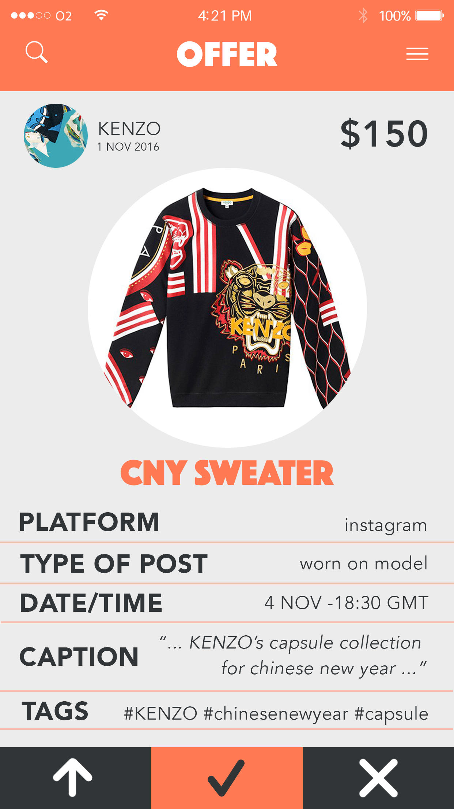

## MY ROLE

I was brought on as designer after the idea won a university app pitch competition. The team consisted of the founder and two developers. I was responsible for the visual and user interface design of the app as it moved from concept to first functional build and into later iterations. My responsibilities included, structural and experience design, wire framing and generating high fidelity mock ups.

<h4 align="center">CONTENTS</h4>

    <a href="#aim" style="white-space: nowrap">The Aim</a> 
    <a href="#problem" style="white-space: nowrap">The Problem</a> 
    <a href="#personas" style="white-space: nowrap">The Personas</a> 
    <a href="#flow" style="white-space: nowrap">Designing User Flow</a> 
    <!-- <a href="#pitch" style="white-space: nowrap">Pitch Brief</a>  -->

## THE AIM

To provide a simple, streamlined experience for:

<ol>
    <li>Social media influencers looking to monetise through brand affiliations</li>
    <li>Products and brands looking to use social media exposure for marketing</li>
</ol>

## THE PROBLEM

<ol>
    <li>
Fragmented communication channels

        <ul>
            <li>Almost all social media has a personal messaging system. For influencers with large profiles spanning several platforms, offers to promote a product could be sent to any of them.</li>
        </ul>
    </li>
    <li>
One-sided outreach

        <ul>
            <li>At the moment, marketing teams tend to make first contact with influencers they are interested in collaborating with.</li>
            <li>Opportunities to contact marketing teams are limited and are often very noisy channels.</li>
        </ul>
    </li>
    <li>
Lack of quantitative metrics

        <ul>
            <li>Marketing teams struggled to access and analyse data to quantify the return of influencer based marketing.</li>
        </ul>
    </li>
</ol>

## THE PERSONAS

<h3>Ashley</h3>

Ashley is a fashion blogger with 10,000 followers. She’s been contacted by companies in the past asking if she’d be interested in being paid to wear their clothes in her posts. With the number of requests increasing and coming from a variety of sources, she wants to be able to manage them efficiently, cultivate more partnerships and track her growth and earnings.

<h3>Terry</h3>

Terry is the marketing director at a boutique clothing brand looking to gain exposure and promote its products through social media. He often browses through Instagram looking for established profiles whose style and visual aesthetic would suit their brand. He wants to contact influencers he likes, set up transactions and track their success simply and efficiently. He would be open to allowing new talent to contact him as long as he isn’t overwhelmed.

## DESIGNING USER FLOW

To understand what screens to design and how users would progress through our app it was important that we mapped out the desired interactions we wanted users to have. This was especially important because we were designing for two distinct user groups and we wanted their experiences to be as streamlined and personalised as possible.

I soon realised that the fundamental structure of the “Influencer” and “Promoter” work flow was very similar, they were just performing a slightly different action at each stage. This was a key reason for the ultimately mirrored design of our app, which is expressed through our colour scheme and screen layouts.

#### ONBOARDING

#### INFLUENCER FLOW

#### PROMOTER FLOW

## KEY DESIGN DECISIONS

#### SPLIT APP

Early on in the design process, it was clear we had two distinct user groups who had different motivations for using our app. In our goal to be the bridge for communication between the groups, we chose to completely separate their user experiences. It would allow us to cater each experience more specifically to each user group and better respond to feedback from both groups.

The alternative was to create a unified interface that catered to both groups. In putting together initial sketches of what this would look like, it became clear that especially on a mobile interface where screen real estate was scarce, it was important to make screen content context based. This meant understanding what the user was there for and only providing the necessary information.

Ultimately, I successfully pitched a split app layout despite some initial reluctance from my team members. Our app could be interpreted as two separate apps that shared information, but I used similarities in their workflow structure and consistent design elements to tie them together into a unified visual design.

The colour coding and ‘mirrored’ design was the result of these investigations and a conscious effort to address a potential edge case where a user was both an influencer and a promoter (i.e. they had launched a personal brand). The split app structure reflected this dual identity and allowed these users to keep there respective business goals clear and separate.

  

    
  

  

    
  

Animated slideshow of the screens designed for Version 1. Exported from Adobe XD.

  

    
  

  

    
  

Animated slideshow of the screens designed for Version 1. Exported from Adobe XD.

<!--
## PITCH BRIEF

 -->
