My undergraduate individual project was to research, design and build a virtual reality platform for administering Self-Attachment therapy. A full copy of my thesis is available <a href="./thesis.pdf" download>here</a>.

<video controls style="width: 100%">
<source src="./IndvProj.mp4" type="video/mp4" />
</video>

A walk through of the platform

<h4 align="center">CONTENTS</h4>

    <a href="#motivation" style="white-space: nowrap">The Motivation</a> 
    <a href="#goal" style="white-space: nowrap">The Goal</a> 
    <a href="#platform" style="white-space: nowrap">The Platform</a> 
    <a href="#interactions" style="white-space: nowrap">Designing Interactions</a> 

## THE MOTIVATION

The premise for this project was formed based on the self-administerable nature of the protocols of self-attachment therapy. The therapy was designed to be practiced by the patient without need for a therapist over an extended period of time to create lasting improvements.

Virtual reality was identified as a viable medium for administering this therapy because it makes significant use of visualisation and imagery techniques. It requires users to imagine interactions with an inner child and attempt to form an affectional bond with them.

As a self-administrable intervention for chronic anxiety and depression, SAT presents a structured method that patients can use to self-manage. By building a cohesive platform that patients can use to guide them through the therapy, a SAT platform could be a powerful contributor to the movement towards making mental health services more accessible. While the protocols designed to help patients conceptualise the inner child are highly structured and have proven effective, the feedback received often highlighted the difficulty of this visualisation. By introducing patients to Self-Attachment Therapy through a virtual inner child, the aim is to help patients more easily transition to practicing the protocols with an imaginary inner child.

## THE GOAL

<ul>
    <li>
        <b>Overcome Barriers to Accessing SAT</b>  
        The primary reason for considering the use of VR for administering SAT was because it could help users who could not sufficiently imagine their inner child to visualise the inner child and therefore undertake SAT.
    </li>
    <li>
        <b>Ensure Accessibility</b>  
        As a platform used to administer a medical intervention, it is important it is accessible to those with special needs and disabilities.
    </li>
    <li>
        <b>Integrate Speech Recognition and Motion Detection</b>  
        This platform's development seeks to demonstrate that in VR motion detection and speech recognition are viable alternative methods of collecting user input. 
    </li>
</ul>

## THE PLATFORM

#### STAGE I

In this VR platform, in addition to introducing patients to self attachment, Stage I also provides onboarding for first time users of VR. For more detail on how the onboarding process was designed see 4.5 Designing the Onboarding Experience.

Therefore, as the primary aim of Stage I is educating the user, both in SAT and in how to use the VR platform, the design and experience of the room, is different from the other stages. Stage I centers around a screen wherein users can click through a set of slides (see B.1 Stage I) with instructions detailing how to navigate the VR platform, i.e. using controllers and speech control, as well as a brief introduction to Self-Attachment Therapy and the role of the VR Inner Child.

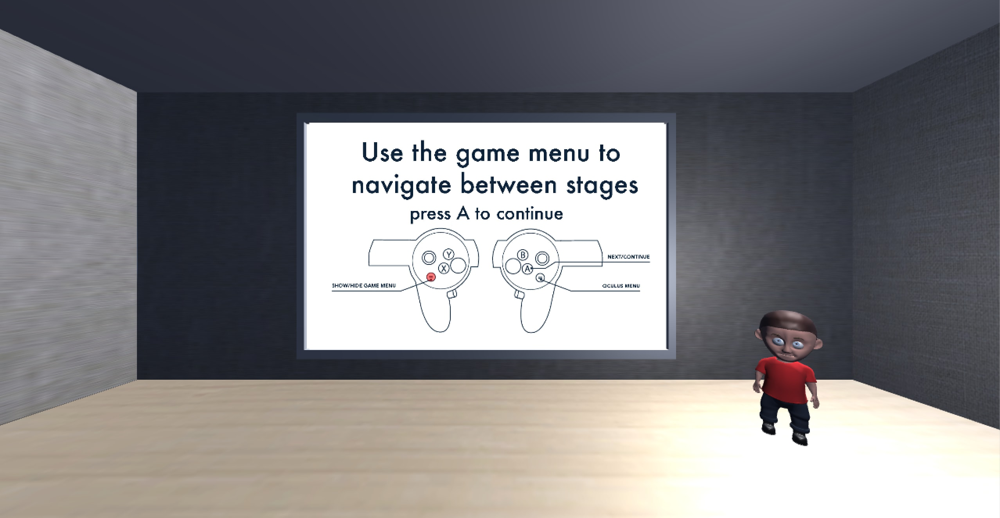

The Stage I Room: providing an introduction to to SAT in VR and the inner child

#### STAGE II

The menu in Stage II consists of three separate activities that the patient can choose between:

<ul>
    <li>
        <b>Happy Activity</b>  
        Through a series of questions, the patient is invited to recall and reflect on a happy memory from their childhood, focusing on how the behaviour of their primary caregivers affected the experience. This activity does not involve any direct interaction with the VR inner child; the patient simply reflects on a series of questions presented as part of the instruction set.
    </li>
    <li>
        <b>Sad Activity</b>  
        Through a series of questions, The patient is invited to recall and reflect on a sad memory from their childhood, focusing on how the behaviours of their primary caregivers affected the experience. This activity does not involve any direct interaction with the VR inner child.
    </li>
    <li>
        <b>Compassion Activity</b>  
        The patient is presented with a distressed child and asked to offer it verbal and physical compassion as they would have wanted. In this activity, the patient is asked to 'cuddle' the VR inner child to offer it physical compassion. 
    </li>
</ul>

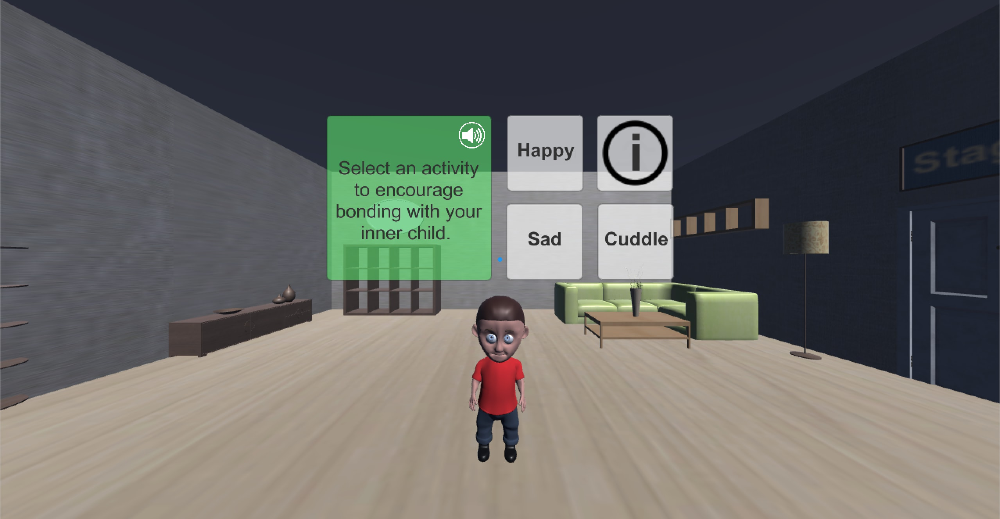

Stage II Activity Menu allowing users to choose between activities

#### STAGE III

In these activities, there are no direct interactions with the VR inner child. The patient either reflects on a series of questions presented as part of the instruction set, or performs an action 'with' the inner child, who is given a fixed animated behaviour for each activity. The menu in Stage III consists of four activities the patient can choose between:

<ul>
    <li>
        <b>Singing Activity</b>  
        The patient is invited to imagine they are forming a deep affectionate bond with the VR inner child while singing their happy song and moving their body to the music. A pre-selected karaoke music video is shown on the screen in the VR room. 
    </li>
    <li>
        <b>Dancing Activity</b>  
        The patient is invited to imagine they are engaging in a loving dialogue with the inner child and bonding while dancing along with the inner child. A pre-selected dance video is shown on the screen, giving the patient different dance moves to follow. 
    </li>
    <li>
        <b>Self-Massage Activity</b>  
       The patient is shown a video tutorial on how to perform self-massage. They are invited to imagine they are physically interacting with the inner child while performing the massage.
    </li>
    <li>
    <b>Pledging of Love Activity</b>  
       Through a series of questions, the patient is invited to reflect on optimal parenting behaviours and vocally pledge to love and support the inner child unconditionally.
    </li>
</ul>

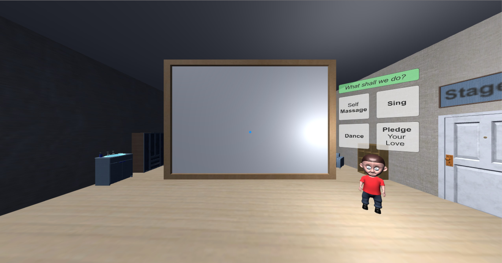

Stage III Activity Menu allowing users to choose between activities. The screen displays the self-massage, singing and dancing videos for each protocol.

#### STAGE IV

In Stage IV, the patient can choose from a series of subprotocols A, B, C, D, E, F. Protocols A - D involve either some form of physical interaction with the child, and/or a transition to a different, specially designed protocol room. Protocols E and F are stationary reflection protocols that take place in the main Stage IV menu room.

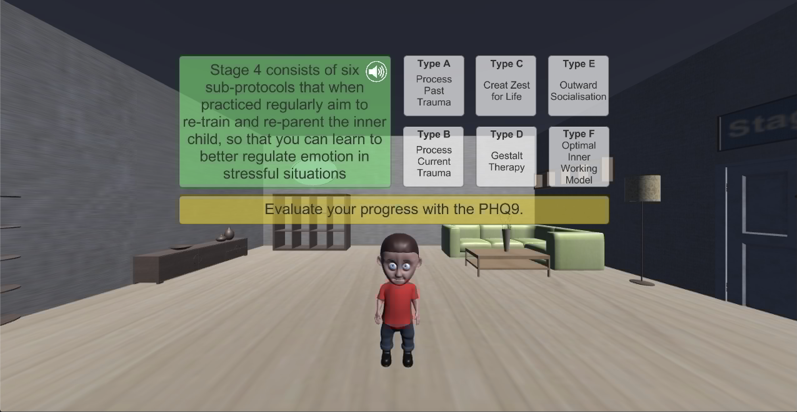

Stage IV menu allowing users to choose between subprotocols.

<ul>
    <li>
        <b>Type A - Process Past Trauma</b>  
        In a blackout environment, the patient is invited to recall a traumatic past event, focusing on how they would have liked their primary caregivers to have supported them. The patient is then presented with a distressed child and asked to offer verbal and physical compassion as they would have liked. The patient is asked to 'cuddle' the VR inner child to offer it physical compassion. Upon successfully consoling the child, the initially dark and bare room then opens up to a better lit, furnished room.
    </li>
    <li>
        <b>Type B - Process Current Trauma</b>  
        The patient is invited to reflect on any current negative emotions and project them onto the inner child. The patient is then presented with a distressed child and asked to offer verbal and physical compassion in their role as the adult self. The patient is asked to 'cuddle' the VR inner child to offer it physical compassion. Upon successfully consoling the child, the initially dark and bare room then opens up to a better lit, furnished room. The experience is identical to Type A, except with different instructions.
    </li>
</ul>

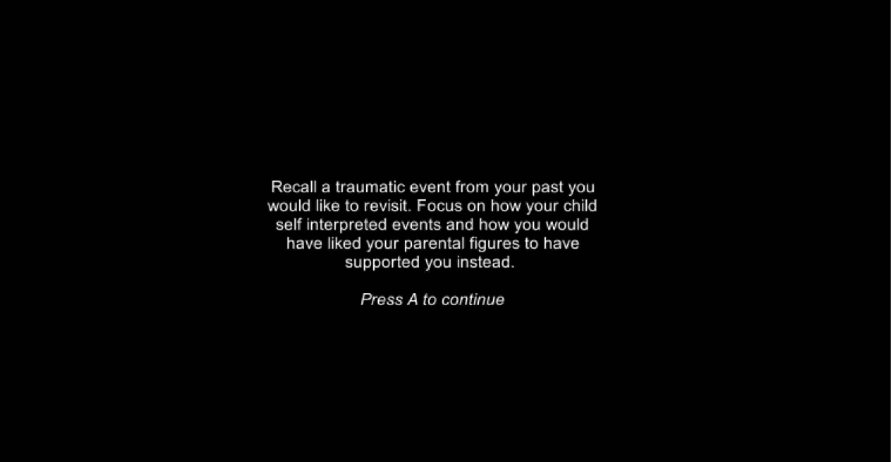

Black out environment with instruction text for Protocol Type A.

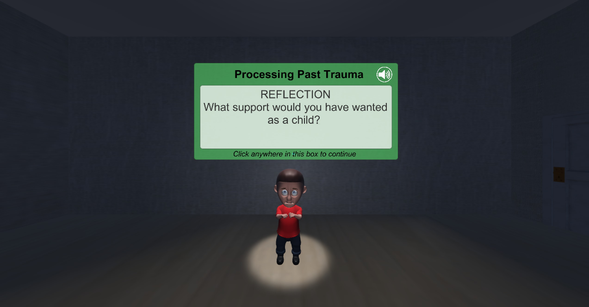

Dimly lit room where patient is asked to console a distressed child.

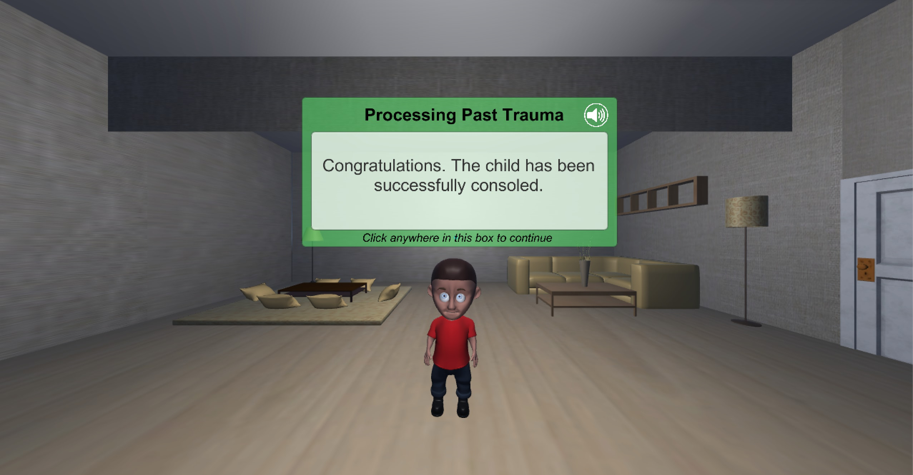

Brightly lit, furnished room emerges from behind a raised wall after the patient offers verbal and physical compassion to the inner child.

<ul>
    <li>
        <b>Type C - Create Zest for Life</b>  
        The patient is presented with a mirror in which their reflection has the image of the inner child. They are asked to sing and dance in the body of the inner child; an illusion created by the VR mirror through motion detection. They are also asked to try and integrate singing and dancing with the child into their daily life, so as to maintain a constant relationship with the child and use it to tackle negative emotions, habits and addictions. 
    </li>
</ul>

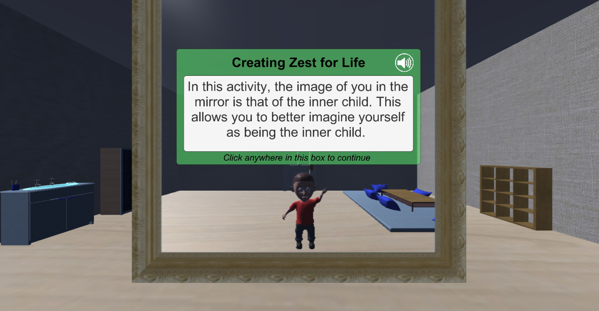

The patient is presented a mirror where their reflection has the image of the inner child. The child mirrors changes in position, rotation and basic actions like dancing and a raised hand.

<ul>
    <li>
        <b>Type D - Gestalt Therapy</b>  
        The patient is presented with a black and white image of the gestalt vase on a screen behind the VR inner child. They are able to to invert the image colours, toggling between focusing on seeing a vase and seeing two faces. This represents positive and negative interpretations, enhanced by a corresponding toggling of the inner child's expression between happy and sad. The patient is asked to focus on transforming negative emotions into positives by recalling the powerful pattern of love built with the inner child. This activity does not involve any direct interaction with the VR inner child. The patient simply reflects on a series of questions presented as part of the instruction set.
    </li>
</ul>

  

    
    
According Gestalt Colour Therapy, viewers are drawn to focus on darker elements of the image. Hence this colouring draws attention to the two faces interpretation of the image. This is associated with positive emotion because it can interpreted as the faces of the adult self inner child, representing their bond.

  

  

    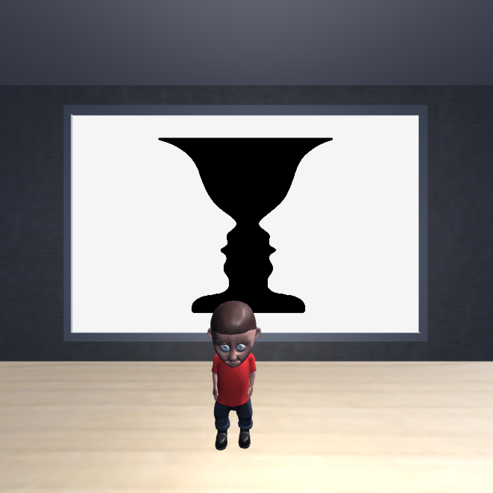
    
Gestalt Colour Therapy suggest that viewers attentions will be drawn to the darker coloured shape of the vase. This is associated with negative emotion because it represents an endless accumulation of dark thoughts.

  

<ul>
    <li>
        <b>Type E - Outward Socialisation</b>  
        The patient is invited to try and habituate the protocols into their everyday life and extend the compassion developed for the inner child toward others. They are asked to take on the role of the good parent, continuing to display affection as well as discouraging the inner child from acting on negative emotions. This activity does not involve any direct interaction with the VR inner child. The patient simply reflects on a series of questions presented as part of the instruction set.
    </li>
    <li>
        <b>Type F - Optimise Internal Working Model</b>  
        Through a series of questions, the patient is invited to reflect on how their negative schemes of thoughts and feelings stemmed from the behaviour of the primary caregivers when they were a child. They are then asked to begin practicing a modified Type B protocol, focusing on identifying the roots of any negative emotions in their family background and childhood relationships. This aims to help them understand their internal working model. This protocol relies on the long term nature of Self-Attachment Therapy, asking the patient to gradually emerge from the view of themselves as a prisoner to their early relationships and create a more optimal internal working model for interpreting and managing relationships. This activity does not involve any direct interaction with the VR inner child. The patient simply reflects on a series of questions presented as part of the instruction set.
    </li>
</ul>

## DESIGNING INTERACTIONS

<video controls style="width: 100%">
<source src="./Gestures.mp4" type="video/mp4" />
</video>

An overview of the physical interactions of cuddling and mirroring in the platform

#### CUDDLING THE CHILD

In the third and final iteration of this experience, joystick navigation had been removed from the platform in favour of a more stationary experience. This was because as the protocols were designed, it became clear that the ability to move freely around the VR environment beyond a few steps was not particularly useful except for the cuddling experience where users had to use it to fine-tune their position. In addition, early user testing raised concerns about motion sickness and the ease ofuse of the joystick controls. This indicated it could become a further barrier to access for less technologically acquainted users.

Therefore, in the final version, the assumption was that the user would be relatively stationary meant the child no longer followed the user around constantly. Instead, it stays in a fixed position until the protocol requires a cuddle. It then walks directly forward until it is close enough to the user to receive a cuddle. The user may still have to make slight adjustments to get closer or lower, but these are very small and quite intuitive. Once the user's hands are detected to have 'cuddled' the child, the child turns and walks back to its original position. In this way, the bulk of the set up for cuddling is performed by the VR platform by guiding the child towards the user.

  

    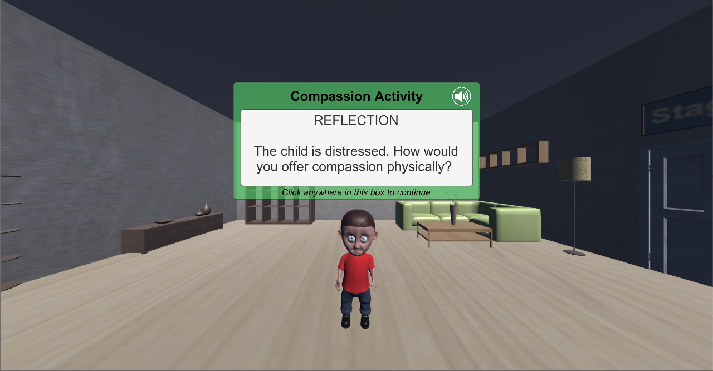
    
1) The child starts in a fixed position

  

  

    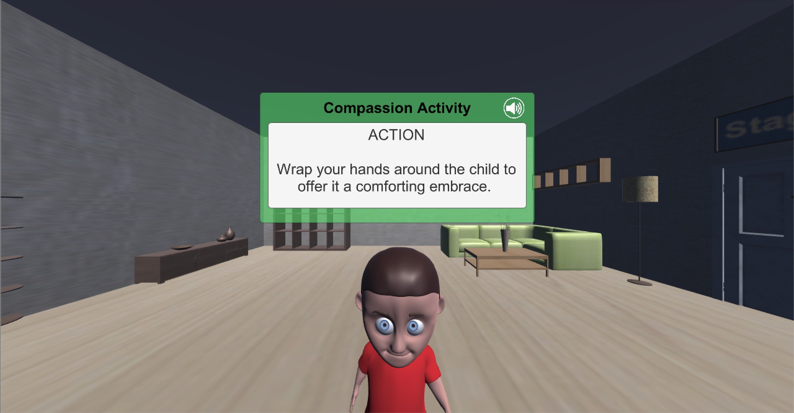
    
2) The child walks towards the user

  

  

    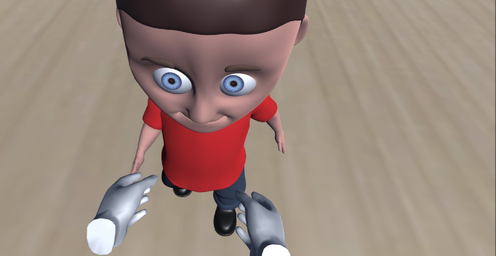
    
3) The user reaches out with both hands to give the child a cuddle

  

  

    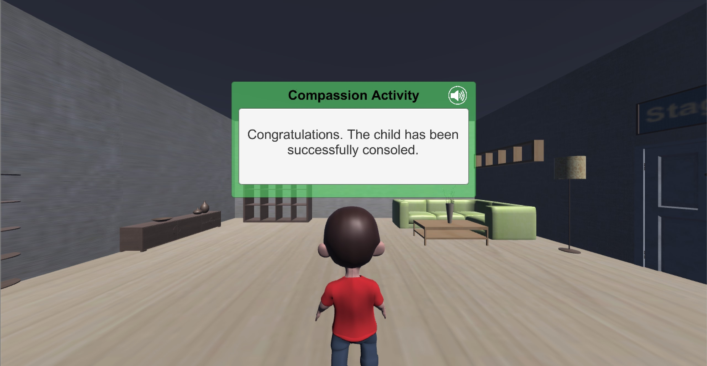
    
4) After a successful cuddle, the child walks back to its starting point

  

#### MIRRORING THE CHILD

The mirroring component of Stage IV Protocol Type C presented a unique design challenge. The non-VR protocol asked users to perform the protocol standing in front of a mirror. Therefore, it followed that the VR platform should provide a mirror in the VR environment. The aim of the mirror was to help users imagine that their image in the mirror was that of their inner child. In VR, it is possible to create the illusion that the user's body is physically embodied within the child's body. Therefore, when looking in a mirror they actually see the child's reflection as though it is their own.

However, it became evident that the quality of the illusion's realism was dependent not on the mirror, but the ability for the child model to copy the user's movements in real time. This was limited by the number of animations available for the child model and the level of tracking the Oculus provided. For example, it would be difficult to animate the child to copy the user's walking motion as there are no sensors on the user's feet or legs.

Therefore, the design of the mirroring experience was limited by what was viable in the time available given it was only a small section of the platform. It represents a proof of concept towards what could be possible if more time was dedicated to build and calibrate real time avatar mirroring into the child model.

The child model mirrors user position and rotation without animation. The model can also detect and mimic the motion of raising a hand above the head. The protocol also calls for users to dance and sing to their happy song in front of the mirror. To facilitate this, a dancing motion was defined based on the child model's provided dancing animation. Users move their arms from side to side and once this motion is detected, the child mirrors this motion until the user stops moving. This is intended to provide the experience of dancing while embodied within the child body. The user is introduced to what activities can be performed with the child in the instruction set for the protocol. The instructions incorporate a guided tutorial for how to engage with the motion detection capabilities available before allowing users to experiment freely.
